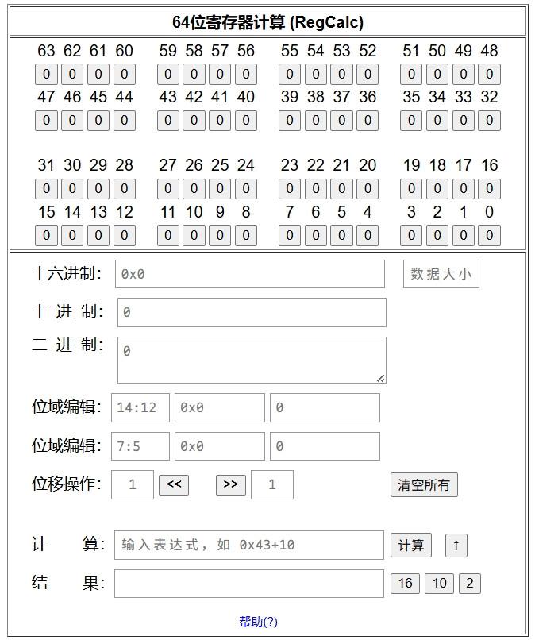

# RegCalcTextTool
**RegCalcTextTool**, RegCalc is a 64 bit register calculator + text formatter 

工具首页：[这里](https://yakoye.github.io/RegCalcTextTool/)

**RegCalcTextTool**：[RegCalcTextTool.html](https://yakoye.github.io/RegCalcTextTool/RegCalcTextTool.html)（推荐）

寄存器计算：[reg_tools_cal-big-to-small_63-0_64bit.html](https://yakoye.github.io/RegCalcTextTool/reg_tools_cal-big-to-small_63-0_64bit.html)

文本处理：[TextFormatter.html](https://yakoye.github.io/RegCalcTextTool/TextFormatter.html)

Refer：

[reg_tools](https://github.com/lzwwiner/reg_tools)

