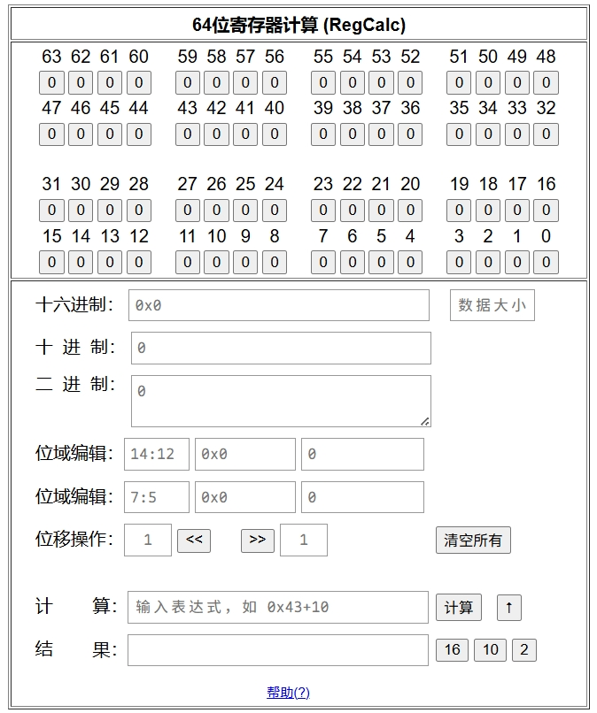

# RegCalcTextTool

RegCalcTextTool 是一个静态网页工具，主要包含：

- `RegCalcTextTool.html`：当前主入口，只负责标签页和按需加载各工具
- `RegCalc64Tool.html`：64 bit 寄存器计算工具页
- `TextFormatterTool.html`：文本处理工具页
- `DateTimeTool.html`：日期时间计算工具页
- `PasswordTool.html`：密码生成器工具页
- `HashTool.html`：独立 Hash / Checksum / HMAC 工具页，由主工具的 Hash 标签按需加载
- `LinksTool.html`：外部工具链接页
- `AboutTool.html`：使用说明和发布记录页
- `reg_tools_cal-big-to-small_63-0_64bit.html`：旧版寄存器计算工具，保留但部署时不作为主入口
- `TextFormatter.html`：旧版文本处理工具，保留但部署时不作为主入口

仓库根目录的 `index.html` 会无提示进入 `RegCalcTextTool.html`，因此 Cloudflare Pages 和 GitHub Pages 访问站点根路径时都能直接进入主工具。

## 在线使用

- GitHub Pages: <https://yakoye.github.io/RegCalcTextTool/>
- 主工具直达: <https://yakoye.github.io/RegCalcTextTool/RegCalcTextTool.html>



## TextFormatter

TextFormatter 按七类组织功能：文本清理、行与列表、大小写与命名、编码与转义、数据格式化、Hex与字节、生成器。

- 原文/结果工作流：转换结果写入结果框，可复制、清空、交换原文与结果，或把结果送回原文继续处理；两侧都会统计字符数、行数和 UTF-8 字节数。
- Base64：支持 UTF-8 文本与 Base64 互转、标准 Base64 与 URL-safe Base64 互转；文件或图片可点击选择或拖放，输出纯 Base64 或 Data URL，并可从 Base64/Data URL 解码、预览图片和下载文件。单个文件及解码结果上限为 16 MiB。
- URL 与转义：区分 URL component 和完整 URL 的编码/解码，支持 Query 解析与构建、HTML 实体编码/解码以及 Unicode 转义/反转义。
- 数据格式：支持 JSON 格式化、压缩、校验、Key 排序和字符串转义，支持 JSON/YAML、CSV/TSV、Markdown/HTML 双向转换，以及 XML 格式化和压缩。
- 表格工具：可视化编辑表格，支持 GFM Markdown、HTML 和 TSV 双向导入导出。HTML 保留合并跨度；GFM 和 TSV 导出会把合并主单元格内容写入覆盖位置，重新导入后不恢复合并关系。单元格换行在 GFM 和 HTML 中输出为 `<br>`，TSV 使用带引号的多行字段保留。
- Hex 与序列：支持 Hex 规范化、分组、大小端、字节反转、UTF-8/二进制/十进制互转和 C/JavaScript 字节数组。序列参数区位于原文/结果框上方，范围包含开始与结束值，支持十进制或十六进制、升序、降序、随机和 0–10 位补零；十六进制使用大写数字及 `0x` 前缀，位数不包含符号和前缀。自定义分隔符仅在分隔方式选择“自定义”时显示；边界必须是安全整数，实际范围最多 10000 项，数量参数只截取而不会扩展范围。

TextFormatter 的第三方依赖均从仓库内 `vendor/` 加载，运行时不使用 CDN。转换和文件处理在浏览器本地完成，文件字节只保存在当前页面内存中。工具默认只保存界面与非敏感参数偏好，不保存原文和结果；只有主动开启“保存原文与结果”后才会保存普通文本，文件字节和识别为敏感的 Base64 内容不会写入本地存储。仍不建议处理真实密码、私钥、Token 或其他高敏感数据。

## Cloudflare Workers 部署

如果在 Cloudflare 的 `Workers & Pages` 中选择 `Import a repository` 创建 Worker，使用下面配置：

1. 在 Cloudflare Dashboard 进入 `Workers & Pages`。
2. 选择 `Create application`，通过 `Import a repository` 连接这个 GitHub 仓库。
3. Framework preset 选择 `None`。
4. Build command 填写：

```bash
npm run build
```

5. Build output directory 填写：

```text
dist
```

6. 保存并创建 deployment。

仓库已包含 `wrangler.toml`：

```toml
name = "regcalctexttool"
compatibility_date = "2026-06-08"

[assets]
directory = "./dist"
```

注意：Cloudflare Workers Git 集成要求 Dashboard 里的 Worker 名称和 `wrangler.toml` 里的 `name` 完全一致。当前配置已按你的 Cloudflare 项目名 `regcalctexttool` 设置。

如果想在本地直接用 Wrangler 部署到 Worker：

```bash
npm run deploy:cloudflare
```

Cloudflare 会发布 `dist` 目录中的静态文件，入口仍然是 `/` 或 `/RegCalcTextTool.html`。

## Cloudflare Pages 备选部署

如果你后续改用 Cloudflare Pages 项目，而不是 Worker 项目，也可以继续使用同一个构建命令：

```bash
npm run build
```

Pages 的 Build output directory 填写：

```text
dist
```

本地手动上传 Pages 可用：

```bash
npm run deploy:pages
```

## GitHub Pages 部署

GitHub Pages 可以直接从仓库根目录发布：

1. 打开 GitHub 仓库的 `Settings`。
2. 进入 `Pages`。
3. Source 选择 `Deploy from a branch`。
4. Branch 选择 `main`，Folder 选择 `/root`。
5. 保存后访问 `https://yakoye.github.io/RegCalcTextTool/`。

根目录已有 `.nojekyll`，GitHub Pages 会按静态文件原样发布。

## 本地构建检查

```bash
npm run build
```

构建后会生成 `dist/`，里面只包含部署需要的静态资源，不包含 `.git`、`node_modules`、`scripts`、`README.md`、PSD 源文件等开发内容。

## 后续添加工具

后续如果继续添加新的静态工具，直接把新的 `.html`、图片、CSS、JS 放到仓库中即可。`npm run build` 会自动复制常见静态资源到 `dist/`。根路径由 `index.html` 无提示进入主工具页。

## 中文修改记录

- 2025.07.25 v0.1 初版
- 2026.03.28 v0.2 修改格式
- 2026.06.08 v0.3 适配移动端显示，优化字体与 RegCalc 表单布局
- 2026.06.08 v0.4 优化位按钮矩阵分组间距，位域编辑支持动态增删
- 2026.06.08 v0.5 计算器支持浮点表达式
- 2026.06.08 v0.6 优化 TextFormatter 手机按钮布局，新增常用文本处理
- 2026.06.09 v0.7 增强 TextFormatter 十六进制分组、大小端、URL、Base64、JSON 处理
- 2026.06.09 v0.8 新增序列生成、日期时间计算、密码生成和外部工具链接
- 2026.06.09 v0.9 外部工具增加图像处理链接
- 2026.06.09 v0.10 调整 TextFormatter 序列区位置，收窄工具页宽度
- 2026.06.09 v0.11 密码生成器记住指定符号和额外排除字符
- 2026.06.09 v0.12 外部工具增加 Awesome-tools 清单
- 2026.06.09 v0.13 优化 Awesome-tools 清单内部分类展示
- 2026.06.09 v0.14 优化序列号码生成布局和位数限制
- 2026.06.09 v0.15 修复 TextFormatter 窄屏文本框高度
- 2026.06.09 v0.16 TextFormatter 操作区改为滚动面板
- 2026.06.09 v0.17 优化手机端标签栏短名称
- 2026.06.09 v0.18 调整日期时间计算器输入排列
- 2026.06.09 v0.19 日期时间计算器输入改为同排行
- 2026.06.09 v0.20 RegCalc 计算输入支持三行自适应
- 2026.06.09 v0.21 放宽 RegCalc 表达式限制并取消128位截断
- 2026.06.09 v0.22 修改界面为英文，提示中文英文
- 2026.06.09 v0.23 修复 RegCalc 精确小数计算，DateTime 增加时间转换联动
- 2026.06.09 v0.24 RegCalc 小数表达式改用 mathjs 计算
- 2026.06.09 v0.25 RegCalc 计算输入支持 × ÷ 和全角运算符
- 2026.06.09 v0.26 Bin(2) 输入框改为按内容动态高度
- 2026.06.09 v0.27 密码生成器增加本地生成与不上传说明
- 2026.06.09 v0.28 优化 DateTime 基准时间与时间转换开关布局
- 2026.06.09 v0.29 DateTime 支持基准时间与当前时间的精确差值
- 2026.06.09 v0.30 Time 标签与说明统一改为 DateTime
- 2026.06.09 v0.31 TextFormatter 按钮按分类折叠为下拉组，新增颜色区隔、悬浮示例提示与清空所有
- 2026.06.10 v0.32 外部工具增加 Unix 时间戳与万年历，首页改为无提示直接进入
- 2026.06.10 v0.33 校准 README 入口说明并复核在线链接
- 2026.06.13 v0.34 优化密码生成器结果列表、复制和编辑交互
- 2026.06.13 v0.35 新增独立 Hash 工具页，支持文本/文件 Hash、HMAC、CRC、偏好保存和按需加载
- 2026.06.13 v0.36 将各标签页拆分为独立工具 HTML，主入口改为按需加载 shell
- 2026.06.13 v0.37 优化 Hash 工具折叠布局、动作按钮位置，并补充 MD4 计算支持
- 2026.06.13 v0.38 调整 Hash 输入区标题栏，将选择文件和清空按钮并入标题行
- 2026.06.13 v0.39 主入口先快速打开 RegCalc，2 秒后后台预加载其他工具页
- 2026.06.13 v0.40 统一现代浅色工具箱 UI，增强 Hash、Password、DateTime、Links 和 About 体验
- 2026.06.13 v0.41 Hash 算法选择改为两级折叠，优化标题对齐、数量统计和状态保存
- 2026.06.13 v0.42 RegCalc 页面升级为冷白磨砂玻璃风，并修复 bit 按钮列宽一致性
- 2026.06.13 v0.43 收紧 RegCalc 桌面布局，统一全站玻璃面板，并补充中文使用说明
- 2026.06.13 v0.44 移除主内容外层大玻璃背景卡片，仅保留独立工具玻璃面板
- 2026.06.13 v0.45 桌面端 RegCalc 计算器固定为 556×657.141 比例
- 2026.06.13 v0.46 桌面端 RegCalc 等比例收缩为约 508×600，控制高度不超过 600
- 2026.06.13 v0.47 收紧顶部 Tab 胶囊与工具卡片间距，并校准 RegCalc 固定宽度
- 2026.06.13 v0.48 上移顶部 Tab 胶囊，进一步缩小间距，并将桌面 RegCalc 高度压到 600 内
- 2026.06.13 v0.49 移除外部工具链接卡片中的“打开”标识
- 2026.06.13 v0.50 手机端主界面与工具面板边距压缩到 1px
- 2026.06.13 v0.51 回退手机端全局 1px 压边距，改为主内容容器和嵌入工具 2px 间距
- 2026.06.13 v0.52 嵌入模式下隐藏非 RegCalc 工具主面板外边框
- 2026.06.13 v0.53 修复 Bin(2) 两行显示、移动端复选框错位、Hash 输入按钮对齐和说明字号
- 2026.06.13 v0.54 Hash 算法选择恢复为 v0.52 折叠实现，修复展开空白问题
- 2026.06.14 v0.55 RegCalc Bin(2) 按 32 位固定分成两行，并统一右侧小按钮尺寸
- 2026.07.11 v0.56 调整 RegCalc bit 网格底部行距，并略微收窄 0/1 按钮
- 2026.07.28 v0.57 重构 TextFormatter 七类工具与原文/结果工作流，新增 Base64 文件、URL/转义、结构化数据、表格、Hex/字节和序列边界处理，并完善本地依赖、偏好保存与敏感内容保护
- 2026.07.30 v0.58 优化 TextFormatter 分类下拉和响应式序列布局，参数区移至文本框上方，新增十六进制序列并按需显示自定义分隔符
- 2026.07.30 v0.59 调整 TextFormatter 为文本框优先布局，分类功能移至下方，并适当增加桌面端文本框高度
- 2026.07.30 v0.60 TextFormatter 分类菜单改为覆盖式浮层，空间不足时自动上拉，打开菜单时收起原参数面板

## Refer

- [reg_tools](https://github.com/lzwwiner/reg_tools)
